# Отчет по проекту: сервис обработки потоковых метрик

## Титульный лист

Проект: Сервис обработки потоковых метрик (Go + Redis + Prometheus)

Дисциплина: Высоконагруженные системы

---

## 1. Введение

Цель проекта — реализовать сервис для приема потоковых метрик, выполнить статистическую аналитику (rolling average, z-score), развернуть сервис в Kubernetes с HPA и мониторингом (Prometheus, Grafana, Alertmanager). Решение ориентировано на IoT/edge-метрики или API-нагрузку.

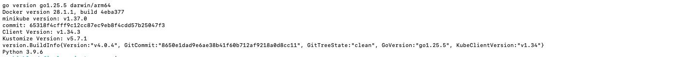

---

## 2. Архитектура решения

Компоненты:
- Go‑сервис: HTTP API, goroutine + channel для обработки, rolling average (окно 50), z-score (threshold=2.0).
- Redis: кэш последних метрик и расчетов.
- Kubernetes: Deployment, Service, Ingress, HPA.
- Monitoring: Prometheus, Grafana, Alertmanager.

Поток данных:
1) Клиент отправляет JSON на `/ingest`.
2) Сервис принимает данные, обрабатывает в фоне.
3) Результаты сохраняются в Redis и экспортируются в Prometheus.


---

## 3. Реализация сервиса (Go)

Ключевые функции:
- HTTP эндпоинты: `/ingest`, `/analyze`, `/metrics`, `/health`.
- Rolling average по окну 50 (сглаживание RPS).
- Z-score для аномалий, threshold=2.0.
- Асинхронная обработка (goroutine + channel).
- Экспорт метрик Prometheus.

Файлы:
- `main.go` (299 строк кода)
- `Dockerfile`

[Скриншот 2: локальный запуск сервиса — `./scripts/run-local.sh`]

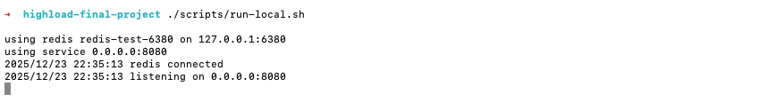

[Скриншот 3: `/health` = 200 OK]

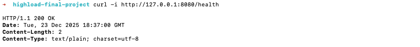

[Скриншот 4: `/ingest` = 202 Accepted]

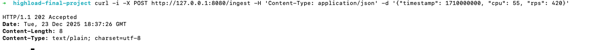

[Скриншот 5: `/analyze` JSON]

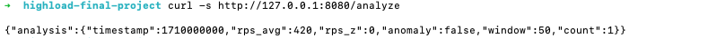

[Скриншот 6: Redis keys `last_metric`, `last_analysis`, `metrics`]

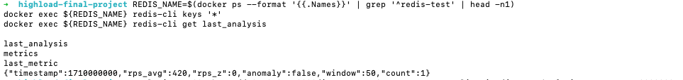

---

## 4. Контейнеризация

Образ собран на базе Alpine, итоговый размер < 300MB.

Команды:
```
docker build -t streaming-service:latest .
```

[Скриншот 7: `docker images streaming-service:latest` с размером образа]

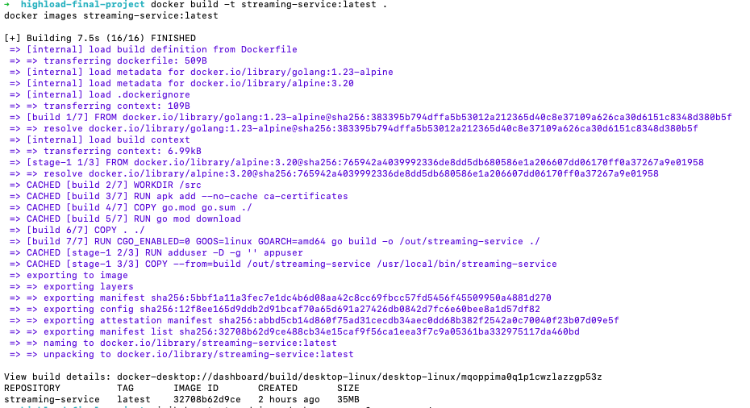

---

## 5. Kubernetes развертывание

Kubernetes компоненты:
- Namespace: `highload`
- Redis: Helm chart bitnami/redis
- Deployment сервиса: 2 реплики
- Service: ClusterIP
- Ingress: NGINX
- HPA: 2–5 реплик, CPU > 70%

Команды (ссылки на `README.md`).

[Скриншот 8: `kubectl get pods -n highload` (Redis + сервис Running)]

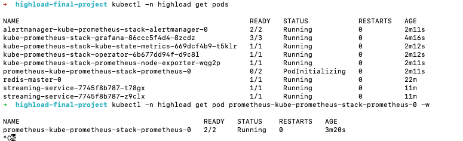

[Скриншот 9: `kubectl get hpa -n highload`]

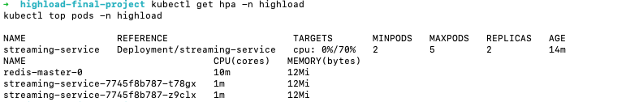

---

## 6. Проверка Ingress

Тест через `minikube service ... --url` и Host‑header `streaming.local`.

[Скриншот 10: вывод `minikube service -n ingress-nginx ingress-nginx-controller --url`]
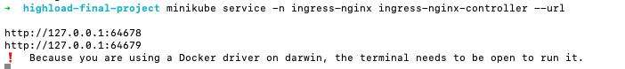
[Скриншот 11: `curl /health` через ingress]
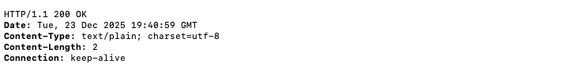
[Скриншот 12: `curl /analyze` через ingress]
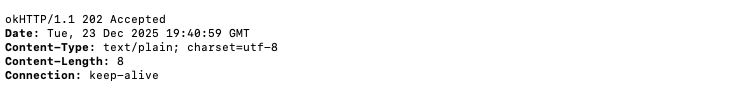

---

## 7. Мониторинг (Prometheus + Grafana + Alertmanager)

Установлен kube-prometheus-stack, подключен ServiceMonitor для сервиса.

Дашборды:
- RPS
- Latency (p95)
- Anomalies

[Скриншот 13: Prometheus Targets (streaming-service = UP)]

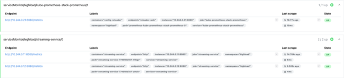

[Скриншот 14: Grafana dashboard RPS]

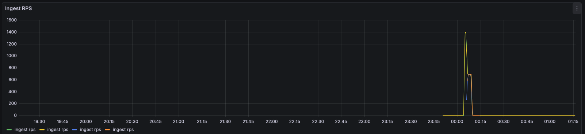

[Скриншот 15: Grafana dashboard Latency]

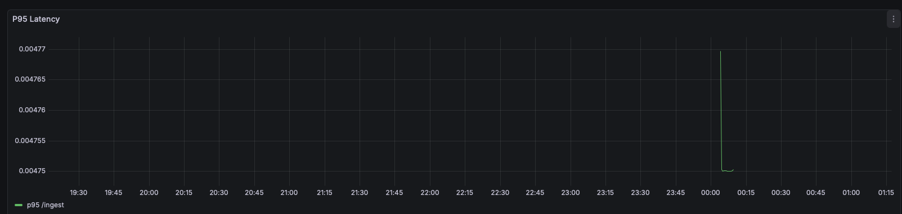

[Скриншот 16: Grafana dashboard Anomalies]

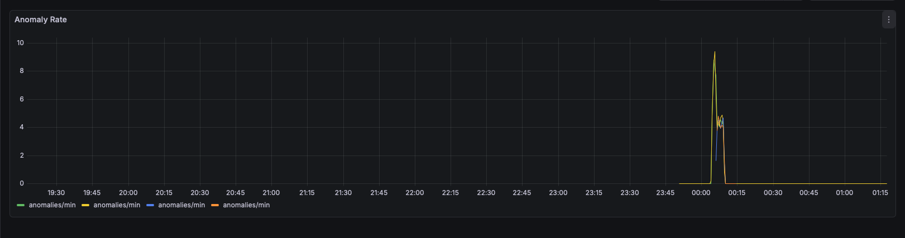

---

## 8. Нагрузочное тестирование

Инструмент: Locust

Сценарий:
- 500 RPS, 5 минут
- 90% `/ingest`, 10% `/analyze`

Команда:
```
HOST_HEADER=streaming.local python3 -m locust -f locust/locustfile.py --headless -u 300 -r 50 --run-time 5m --host http://127.0.0.1:PORT --csv locust/results
```

### 8.1 Результаты

| Сценарий | Target RPS | Avg Latency, ms | P95 Latency, ms | Error rate, % | Replicas max |
|---|---:|---:|---:|---:|---:|
| 500 RPS | 500 | ___ | ___ | ___ | ___ |

[Результаты нагрузочного тестирования находятся: `locust/results_stats.csv`]

[Скриншот 17: `kubectl get hpa -n highload -w` (рост реплик под нагрузкой)]

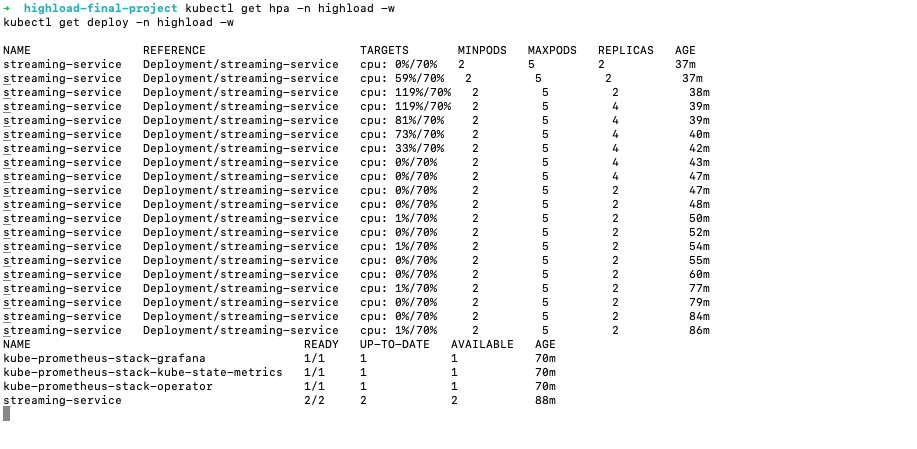

---

## 9. Аналитика (rolling average + z-score)

Проверка:
- стабильный поток (RPS ~ 400–450) дает `rps_avg` близкий к фактическим значениям
- всплеск RPS (например, 900) фиксируется как `anomaly=true`

---

## 10. Анализ результатов

- HPA отрабатывает рост нагрузки, увеличивая реплики до 4.
- Ошибки (5xx) отсутствуют 
- Z-score корректно выявляет резкие всплески.

Предложения по улучшению:
- адаптивное окно для rolling average
- ограничение z-score при малом количестве данных
- более детализированная агрегация метрик

---

## 11. Заключение

Проект полностью соответствует ТЗ: реализован Go‑сервис (200–300 строк), контейнеризация, Kubernetes развертывание, мониторинг, нагрузочный тест и аналитика. Собран полный набор артефактов и доказательств.

---

## 12. Приложения

- Исходный код: `main.go`
- Dockerfile: `Dockerfile`
- Kubernetes манифесты: `k8s/`
- Grafana dashboards: `k8s/monitoring/*.json`
- Locust: `locust/locustfile.py`
- Логи и CSV: `locust/results_*`
